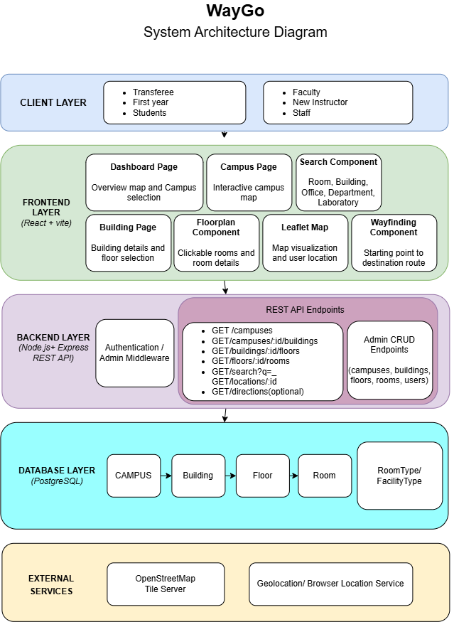

# WayGO - Campus Interactive Map and Wayfinding System
---
## Overview

WayGo is a web app that helps students, visitors, and staff find their way around a school with multiple physically separate campuses. Open one dashboard, see every campus on a real map, drill into a campus to see its buildings, and drill into a building to find the right floor and room.

---
## Core Features
1. Interactive Campus Map – Allows students to view and explore the school campus, buildings, and facilities.
2. Room and Building Search – Allows users to search for a specific classroom, department, office, laboratory, or building.
3. Building and Floor Navigation – Shows the building and floor where a selected room or department is located.
4. Location Details – Displays information such as building name, floor number, room number, and facility type.
5. Directions/Wayfinding – Provides a route from the user's starting location to the selected destination.
6. Campus Area Selection – Allows users to select different campus areas and explore their locations.
7. Accounts – Students, faculty and staff on the school's allowlist register with an email code and log in; admins manage the allowlist.

---
## User Personas

| User Persona | Description | Main Need |
|---|---|---|
| New Student | A student who is unfamiliar with the campus | Find classrooms and buildings easily |
| First-Year Student | A student who is still learning the campus layout | Navigate to different departments and rooms |
| Transferee | A student coming from another school | Quickly locate unfamiliar facilities |
| Senior High Student | A student who may not know all areas of the campus | Find assigned rooms and buildings |
| Faculty/Staff | Teachers and employees who need to locate campus facilities | Quickly find rooms, offices, and departments |

---
## Tech Stack

| Layer | Technology |
|---|---|
| Frontend | React (Vite) + React Router, Tailwind CSS v4, Leaflet / react-leaflet |
| Map data | OpenStreetMap tiles + hand-traced campus/building GeoJSON |
| Backend | Node.js + Express (REST API) |
| Database | PostgreSQL (hosted on Supabase) |
| Email | Nodemailer over SMTP (Gmail) for verification and reset codes |
| Hosting | Vercel (frontend) |

---
## System Architecture Diagram



More diagrams in [`docs/`](docs/):
[ERD](docs/ERD_Diagram.png) ·
[Sitemap](docs/Sitemap.drawio.png) ·
[User flow](docs/userflow.drawio.png)

---
## Repository Structure

```
campus-map-app/   frontend: the campus map, search, wayfinding, and account
                  and admin pages (React + Vite)
Backend/          backend: login, registration, password reset and the admin
                  API (Node.js + Express + PostgreSQL)
docs/             diagrams
```

Each part has its own README with details:
[campus-map-app/README.md](campus-map-app/README.md) ·
[Backend/README.md](Backend/README.md)

---
## Getting Started

Requires Node.js 22 or newer. Run the backend and the frontend in two terminals.

**Backend** (see [Backend/README.md](Backend/README.md) for the database and email settings):

```bash
cd Backend
npm install
cp .env.example .env        # then fill it in; on Windows: copy .env.example .env
npm run migrate
npm run create-admin -- you@example.com "Your Name"
npm run dev                 # http://localhost:4000
```

**Frontend:**

```bash
cd campus-map-app
npm install
echo VITE_API_URL=http://localhost:4000 > .env.local
npm run dev                 # http://localhost:5173
```

Without `.env.local`, the frontend runs on its own with no login, as the
public demo does.

---
## Security

- Only people on the school's allowlist can register, and each account is
  verified with a code sent to its email.
- Passwords and email codes are stored hashed; sessions use an `httpOnly`
  cookie whose token is stored only as a hash.
- Repeated wrong passwords lock the account for 15 minutes, and login and
  code requests are rate limited.
- Database tables are protected with row level security.
- Passwords and keys live only in `.env` files, which are never committed.

Details are in [Backend/README.md](Backend/README.md#security).
